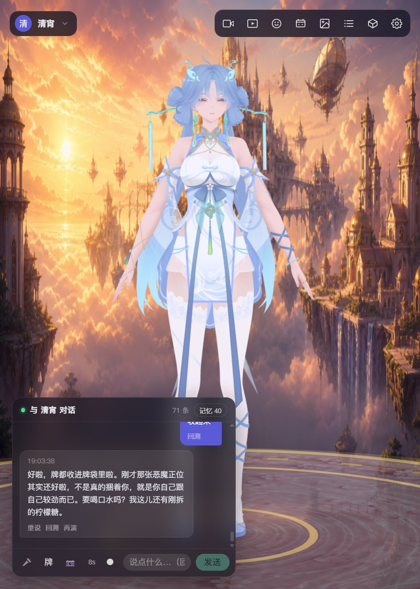
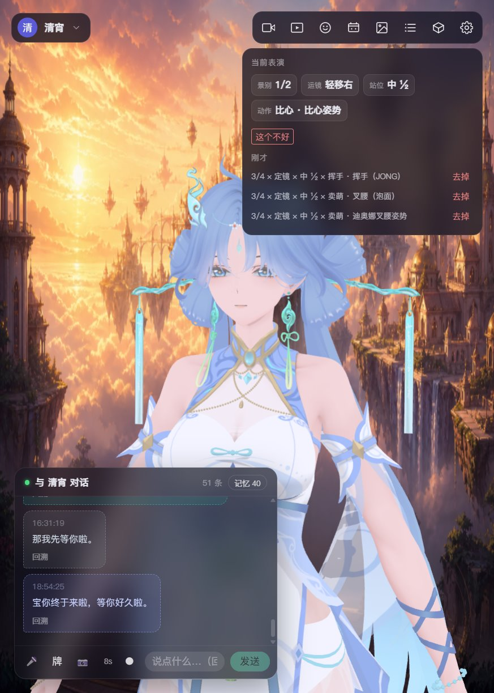
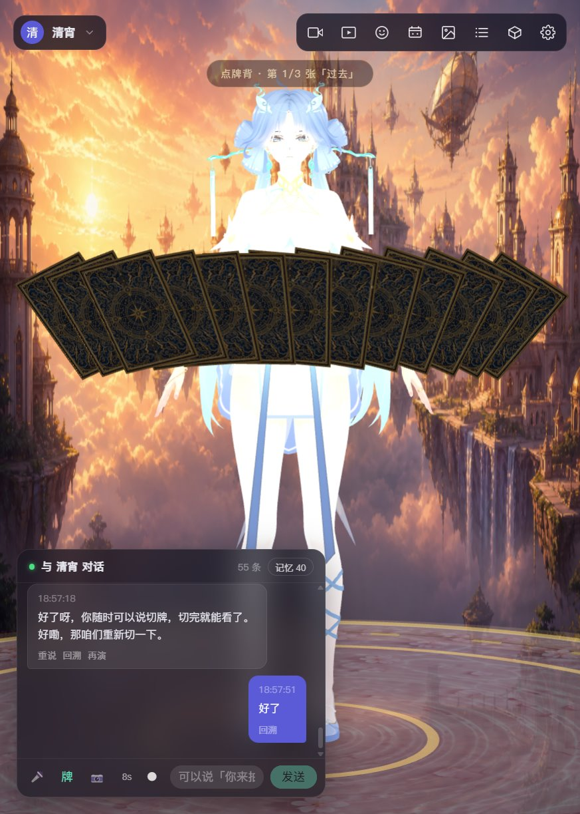
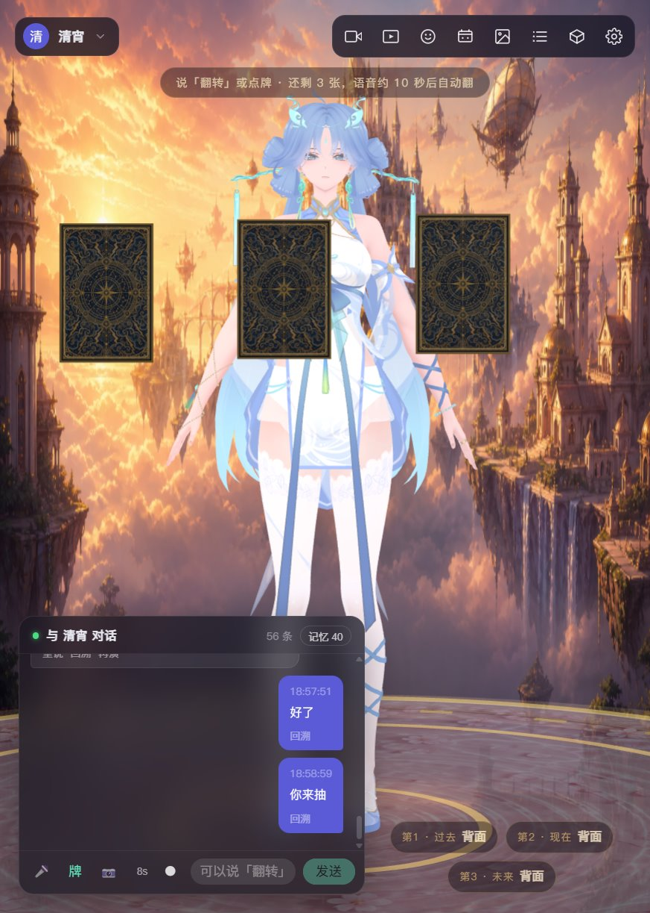
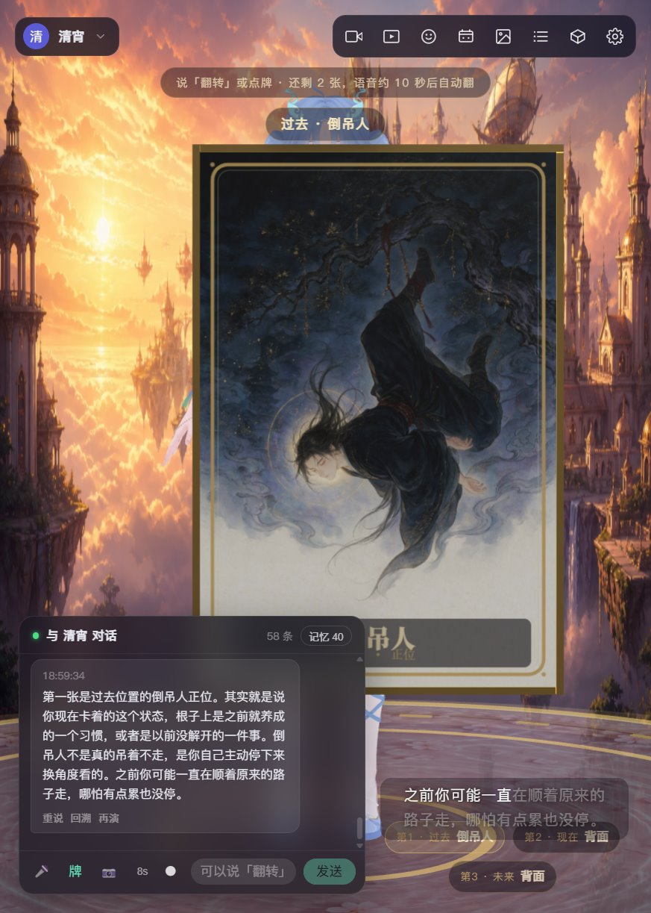
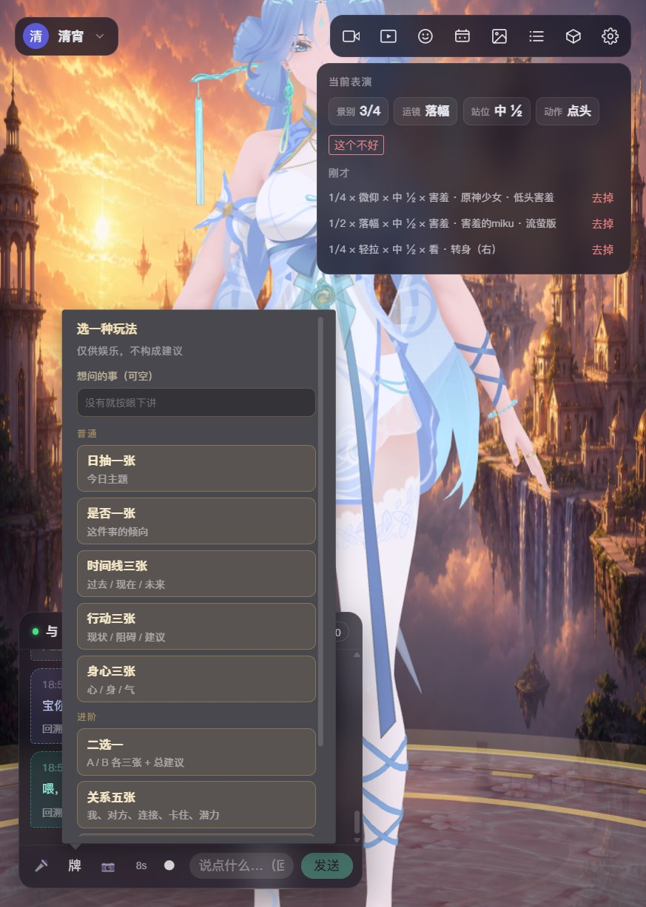
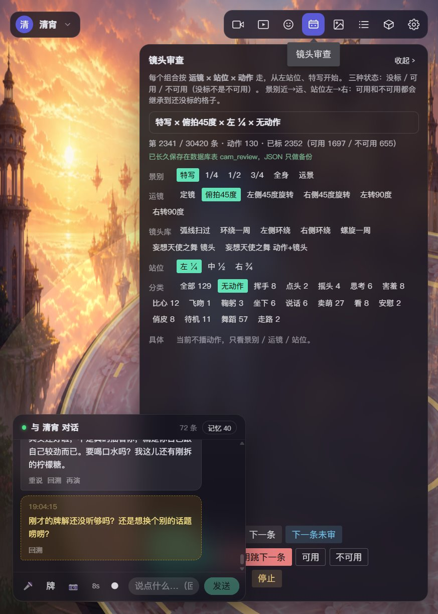
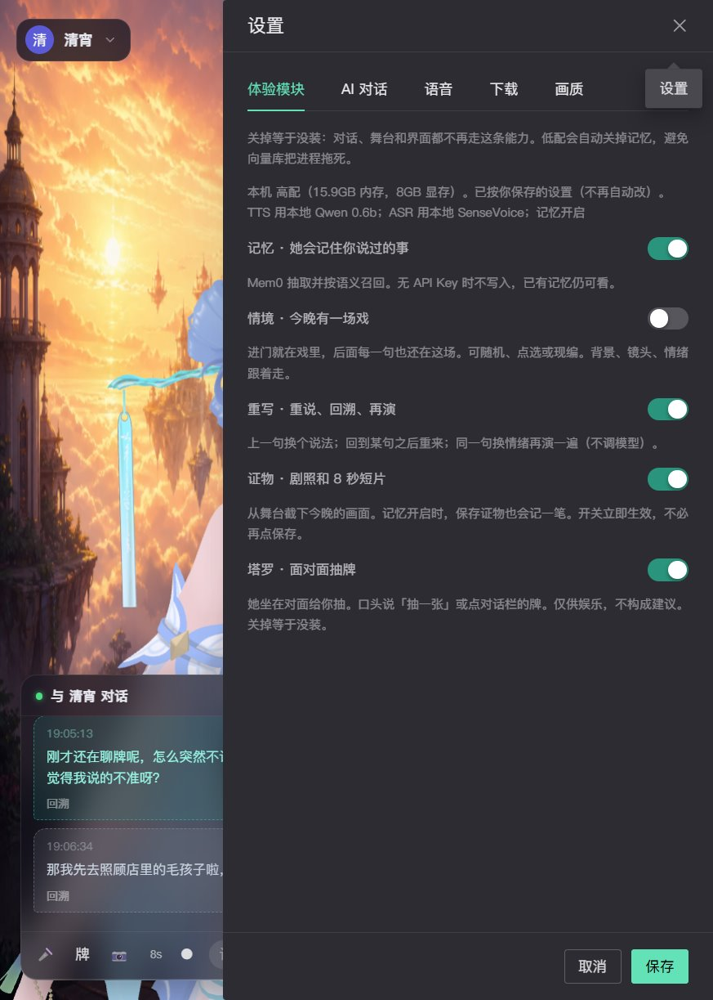
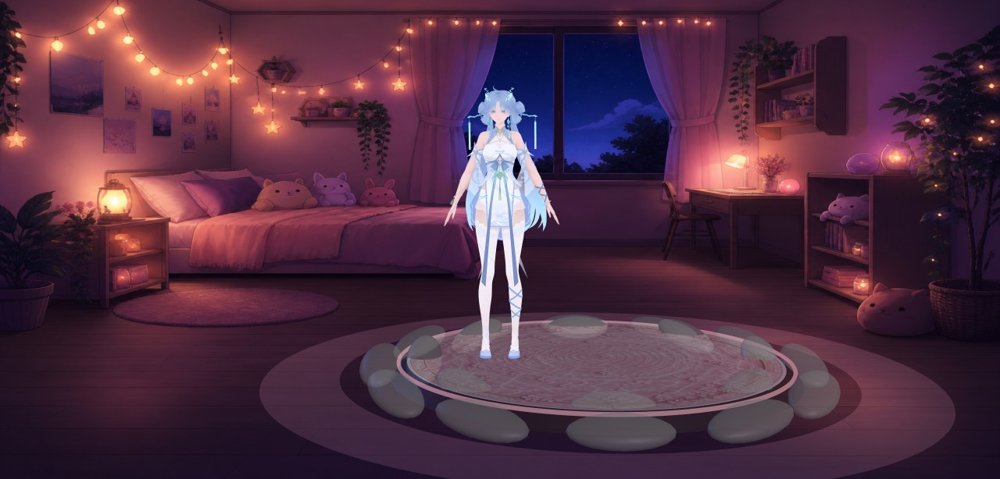

# xiaoke.ai · 小可爱

An open-source, local **3D virtual companion** (桌面 3D 陪玩 / 虚拟陪玩): pick or download a 3D character, set persona and voice, then talk in text or speech. She answers with voice, lip-sync, expression, motion, dance, and camera work — and can sit across from you to draw tarot.

开源免费的**本地 3D 陪玩 / 虚拟陪玩**：选一个 3D 角色坐到对面，用文字或语音聊天。

> **Open source · free · runs on your machine — someone who talks, moves, and remembers you, sitting across the desk.**

- **Open source**: frontend and backend are public; how to run and how to change them is in the docs.
- **Free**: no paywall, membership, or usage cap. LLM and speech can stay local or use free providers.
- **Local**: chat, memory, keepsakes, and speech weights live on your computer. Only the LLM / cloud TTS you configure sees requests.
- **Source is commercial-ok**: [Apache License 2.0](./LICENSE) — use, modify, redistribute, including commercially. The names “xiaoke.ai” / “小可爱” are not transferred; see [NOTICE](./NOTICE).

Stage 3D models, motions, music, and voices are **not** under that license. Copyright stays with each author; follow each asset’s own terms (most prohibit commercial use and redistribution).

[中文](./README.md) · [xiaoke.ai](https://xiaoke.ai)

## What this is: a local 3D companion

A desktop virtual companion: a 3D character sits across from you to chat, dance, and draw cards. Not a webpage popup. Conversation and memory stay on your machine. No membership, no usage cap. Source is Apache 2.0 and may be used commercially.

## Look

<table>
  <tr>
    <td width="50%"></td>
    <td width="50%"></td>
  </tr>
  <tr>
    <td align="center">Talk is performance: face, motion, and camera follow the line</td>
    <td align="center">Top-right shows this line’s shot × camera × stance × motion; drop one if it is wrong</td>
  </tr>
  <tr>
    <td></td>
    <td></td>
  </tr>
  <tr>
    <td align="center">After the cut, backs fan in front of her; tap one or say “you draw”</td>
    <td align="center">Three cards land; she only speaks the one you flip</td>
  </tr>
  <tr>
    <td></td>
    <td></td>
  </tr>
  <tr>
    <td align="center">The card comes to camera; 80 original Chinese-style faces; she meets the feeling first, no fortune-telling</td>
    <td align="center">Daily, yes/no, three-card, either-or, relationship / career five, Celtic Cross</td>
  </tr>
  <tr>
    <td></td>
    <td></td>
  </tr>
  <tr>
    <td align="center">Camera review: tens of thousands of shot × camera × stance × motion rows, marked usable or not</td>
    <td align="center">Memory, scene, rewrite, keepsake, tarot are toggles; off means not installed</td>
  </tr>
  <tr>
    <td></td>
    <td></td>
  </tr>
  <tr>
    <td align="center">Stage stills in the keepsake album: scene cards change backdrop and light</td>
    <td align="center">Same character, another night</td>
  </tr>
</table>

Characters in the screenshots are by aplaybox authors, for demo only. Copyright stays with them.

## What’s in this repo

| Path | What it is |
|---|---|
| [`companion/`](./companion) | **Main product**: Vue frontend + FastAPI backend + Electron desktop shell |
| [`companion/docs/`](./companion/docs) | Design notes: writing a persona, prompt layers, tarot rules and card art, original lyrics |
| [`companion-3d/`](./companion-3d) | Early 3D stage prototype: VRM / GLB / PMX load, expressions, VMD dance |
| [`music-api/`](./music-api) | Standalone research music search API (data source: 爱听音乐网) |

Use `companion/` day to day. `companion-3d` is a smaller sandbox for the render and motion pipeline.

This repo ships **full source**, scene-card backgrounds / stage textures, and the full set of AI-original tarot faces. 3D models, VMD, music, speech weights, SQLite, and API keys stay local. `companion/assets/` keeps empty `models` / `motions` / `cameras` / `audio` / `music` folders with a `README.txt` in each. After clone the stage is empty — import in the asset hub, or drop files where those notes say.

To build a double-click Windows exe (bundled Chromium, Python runtime, models and weights), see [`companion/README_BUILD.md`](./companion/README_BUILD.md) (Chinese).

## Ready-made pack (no compile)

A built Windows pack is on Baidu Netdisk: **A / B as two 7z files**, plus one **all-in-one** 7z.

[xiaoke.ai local 3D companion · Baidu Netdisk](https://pan.baidu.com/s/1Y3KuQWG761eP08Uktx36Eg?pwd=xkai)　password: `xkai`

| You downloaded | What it is | How to open |
|---|---|---|
| `xiaoke-ai-A-….7z` | **A program pack**: window, code, slim Python. Swap this when you update | Extract A and B as **siblings**, then double-click `xiaoke-ai.exe` inside A |
| `xiaoke-ai-B.7z` | **B content pack**: characters, motions, songs, offline speech, PyTorch/CUDA. Rarely re-download | After extract you should see `xiaoke-content.json` |
| `xiaoke-ai-20….7z` (no `-A` / `-B`) | **All-in-one**: program and content in one folder | Extract and double-click `xiaoke-ai.exe`; no B picker |

Extract with [7-Zip](https://www.7-zip.org/). Do not nest A inside B or the other way around. It should look like:

```
D:\xiaoke\
  xiaoke-ai-A-20260904233641\   ← double-click xiaoke-ai.exe here
    xiaoke-ai.exe
  xiaoke-ai-B\
    xiaoke-content.json
```

**First time you open A**: Settings → Content pack → pick the sibling `xiaoke-ai-B` folder (look for `xiaoke-content.json`) → **quit and open again**. The path is stored as `content.path` in the A folder; when you replace A, copy that file over. The all-in-one pack skips this step.

The pack ships its own Chromium; you do not need a browser. Local ports are backend `127.0.0.1:5201` and frontend `127.0.0.1:5211`.

- Windows 10+. Local Qwen TTS prefers an NVIDIA GPU and driver; without one, Settings → Speech → TTS → edge-tts.
- The pack has **no** chat API key. Settings → AI chat: fill an OpenAI-compatible `base_url` / `api_key` / `model`. Empty still gets the stage, dance, and a local fallback reply.
- Do not delete `electron/` or `runtime/` inside A. 3D characters stay copyright of their authors; personal use.

Building from source: [`companion/README_BUILD.md`](./companion/README_BUILD.md).

## What it does

### Stage and performance

- **3D stage**: hot-swap PMX (MMD), VRM, and GLB; MMD cloth physics via ammo.js (hair, skirts, ribbons).
- **Performed chat**: the LLM streams `[emo:]` `[act:]` `[dance:]` `[cam:]` tags and switches face, motion, dance, and camera live. No API key still gets a local fallback so the performance path works.
- **Camera review**: every shot × camera × stance × motion row is scored; only reviewed combos enter the show, to avoid clipping or mismatched moves.
- **Live mocap**: webcam, or a local video for repeatable tests. MediaPipe Holistic runs in a Worker (body, both hands, face) and drives the current character. The solver follows [Reze MiPo](https://github.com/AmyangXYZ/reze-mipo).

### Talk and voice

- **Layered persona**: the character card only holds identity and speech; scene packs, role overlays, time slots, memory, and the director handbook are restacked each turn. Temporary overlays such as “play the teacher” can go on and off without polluting the long-term persona. Built-in character 清宵 is ready to talk.
- **Full-duplex speech**: listen while speaking, queue or barge-in per sentence, then delayed continue / proactive talk after silence. ASR and TTS can each be online or offline. Online: Web Speech + edge-tts / DashScope CosyVoice. Offline: SenseVoice-Small + Qwen3-TTS (local streaming). Lips follow real amplitude; captions stay in sync.
- **Rewrite**: say the same line another way; performance tags still come through.
- **Long-term memory**: preferences, people, and promises are extracted into mem0 + a local vector store and injected into later prompts. Role-play and card-reading turns stay out of memory by default.

### Play together

- **Tarot**: not a popup mini-game — she sits across from you and deals. Backs rise from the table into a ring; the drawn card flies between her and the camera and flips; she tells each one in her own voice. Daily, yes/no, past-present-future, situation-obstacle-advice, body-mind, either-or, relationship five, career five, Celtic Cross. Deal and upright/reversed are decided in code; the model must not change them. 80 original Chinese-style faces ship with the repo. Psychological / entertainment framing, not fortune-telling.
- **Scene cards**: built-in “tonight’s scene” (rain alley, after a fight, under the blossoms, …), or a card generated from memory.
- **Keepsakes**: stage stills and short clips (mediabunny), filed by character.
- **Transcript**: a side drawer for this session’s chat and the backend talk log.
- **Code companion**: tap 「码」 in the chat bar. She watches Cursor start, write, and finish, then plays along. Defaults to local transcripts; an optional user hook. Codex later.

### Assets and characters

- **Asset hub**: import zip / rar / single files (extract, mojibake filename fix, auto-file PMX / VMD / audio); optional search and download from [aplaybox](https://www.aplaybox.com/).
- **Character cards**: model + persona + voice + emotion-to-morph map + idle motion.
- **Module toggles**: memory, scene, rewrite, keepsake, tarot, and Code companion can each be turned off; off means not installed.

Setup, tag protocol, and troubleshooting: [`companion/README.md`](./companion/README.md) (Chinese).

## Stack

### Frontend (`companion/frontend`)

| Layer | Choice |
|---|---|
| App | Vue 3, TypeScript, Vite, Pinia, Naive UI |
| Render | [Three.js](https://threejs.org/) 0.185 |
| VRM | [@pixiv/three-vrm](https://github.com/pixiv/three-vrm) |
| MMD | [three-stdlib](https://github.com/pmndrs/three-stdlib) MMDLoader / MMDPhysics + ammo.js |
| Mocap | [MediaPipe Holistic](https://ai.google.dev/edge/mediapipe/solutions/vision/holistic_landmarker) (Worker) |
| Speech UI | Web Speech API, [@ricky0123/vad-web](https://github.com/ricky0123/vad) (Silero VAD), AEC3 |
| Clips | [mediabunny](https://github.com/Vanilagy/mediabunny) |

Engine code lives in `companion/frontend/src/engine/` (stage, character, motion, face, lips, camera, idle, `StagePlugin`). Features live in `features/` (chat, voice, performance, assets, character, mocap, memory, scene, keepsake, tarot, camera review).

### Backend (`companion/backend`)

| Layer | Choice |
|---|---|
| Server | Python 3.11, FastAPI, uvicorn, SQLModel (SQLite) |
| Chat | OpenAI-compatible HTTP (通义, DeepSeek, Volcengine, …); `prompt_stack` restacks layers each turn |
| Memory | [mem0](https://github.com/mem0ai/mem0) + local [Qdrant](https://qdrant.tech/); cloud embedding or on-device MiniLM |
| ASR | [sherpa-onnx](https://github.com/k2-fsa/sherpa-onnx) running [SenseVoice-Small](https://github.com/FunAudioLLM/SenseVoice) |
| TTS | [Qwen3-TTS](https://github.com/QwenLM/Qwen3-TTS) local streaming; fallback [edge-tts](https://github.com/rany2/edge-tts), DashScope CosyVoice |
| Play | `modules/tarot` dealer + ritual state machine; `modules/scenes`, `memory`, `rewrite`, `keepsake` share the same toggles |

### Desktop shell (`companion/desktop`, `build_exe.py`)

Electron ships the Chromium window. PyInstaller builds a single-file launcher that starts frontend and backend. The release folder includes a Python runtime, backend bytecode, packed frontend, models, and speech weights. The target PC needs neither Chrome nor Python.

## Quick start

Needs Windows, Node.js 18+, Python 3.11+. An NVIDIA GPU helps local Qwen3-TTS; online speech is a full fallback.

Use two terminals of your own. Do not leave the servers as Cursor background jobs (they often survive as orphans after the chat ends).

### Start

**Terminal 1 · backend** (http://127.0.0.1:8600)

```bat
cd companion\backend
set NO_PROXY=*
set PYTHONUNBUFFERED=1
.venv\Scripts\python.exe -m uvicorn app.main:app --host 127.0.0.1 --port 8600
```

PowerShell, first two lines:

```powershell
$env:NO_PROXY='*'; $env:PYTHONUNBUFFERED='1'
```

**Terminal 2 · frontend** (http://localhost:5175)

```bat
cd companion\frontend
npm run dev
```

Open http://localhost:5175. Fill an OpenAI-compatible `base_url` / `api_key` / `model` in Settings for real chat.

Notes:

- Do **not** pass `--reload` or `--workers` on the backend. After Python changes, Ctrl+C in terminal 1 and start that uvicorn line again.
- First-time venv and deps: `python -m venv .venv`, then `.venv\Scripts\pip install -r requirements.txt`; frontend `npm install --legacy-peer-deps`. Or run `start.bat` once under `companion/` to install and open two windows.

### Stop

Ctrl+C in both terminals. If a port is still held (the page talks to an old process):

```powershell
foreach ($port in 8600, 5175) {
  Get-NetTCPConnection -LocalPort $port -State Listen -ErrorAction SilentlyContinue |
    ForEach-Object { taskkill /PID $_.OwningProcess /T /F }
}
```

An empty stage is expected until you drop a PMX / VRM / GLB into the asset hub. Offline ASR / TTS weights download on first “prepare model”; do not commit `companion/backend/data/`.

## Docs index

| Doc | Contents |
|---|---|
| [`companion/README.md`](./companion/README.md) | Config, tag protocol, FAQ |
| [`companion/README_BUILD.md`](./companion/README_BUILD.md) | Pack a double-click exe folder |
| [`companion/docs/persona-guide.md`](./companion/docs/persona-guide.md) | Writing a character card: short base, rules per scene, role-play as its own layer |
| [`companion/docs/persona-stack.md`](./companion/docs/persona-stack.md) | How each turn’s system prompt is stacked, and why |
| [`companion/docs/personas/`](./companion/docs/personas) | Paste-ready persona text (清宵, generic) |
| [`companion/docs/tarot.md`](./companion/docs/tarot.md) | Tarot framing, compliance, ritual flow, how it meets the stage |
| [`companion/docs/tarot-cards.md`](./companion/docs/tarot-cards.md) | Per-card design and art notes for the 80 faces |
| [`companion/docs/songs/`](./companion/docs/songs) | Original Chinese-style lyrics used on stage |

Most of the docs above are in Chinese.

## Acknowledgements

We stand on work other people already shipped. Please tell us if we missed someone.

### aplaybox, and every author there

The stage would be empty without **[模之屋 / aplaybox](https://www.aplaybox.com/)**.

Almost every 3D model, facial morph, VMD motion, and camera file we use comes from aplaybox: it is both the search/download door and the place MMD authors have been sharing work for years.

We also thank every author who published models, expressions, motions, or cameras there. The characters only “live” in the browser because of that work. Copyright stays with each author. Keep credit lists, follow each work’s own terms, and do not redistribute or use commercially. Do not commit an aplaybox token to this repo.

### Ideas and algorithms

- **Xiaoice (小冰)**  
  Full-duplex spoken interaction: listen while speaking, queue or barge-in per sentence, then delayed continue / proactive / goodbye after silence. Our dialogue timing (`DuplexCmd`, sentence types, play-or-skip in the pool) follows that side of Xiaoice, instead of locking a whole reply before playback.
- **Doubao (豆包)**  
  Multi-part system restacked each turn, account-level persona vs session role-play, memory guardrails, code-side intercept before prompt text. Our `prompt_stack` is inferred from that public behavior; see [`persona-stack.md`](./companion/docs/persona-stack.md).
- **[AmyangXYZ](https://github.com/AmyangXYZ) / [Reze MiPo](https://github.com/AmyangXYZ/reze-mipo)** (formerly MiKaPo)  
  MediaPipe landmarks → MMD parent-local quaternions: rest `parent → child` world direction as the reference, shortest-arc per frame, witness bones for arm/thigh roll. Our solver in `companion/frontend/src/features/mocap/` follows that pipeline and adapts it for PMX / VRM / GLB.
- **Géry Casiez, Nicolas Roussel, Daniel Vogel** — [1€ Filter](https://gery.casiez.net/1euro/) (CHI 2012)  
  One-Euro smoothing on mocap: damp jitter at rest, open the cutoff on fast motion.
- **Higuchi Yu / MikuMikuDance**  
  PMX, VMD, morphs, and rigid-body physics — the workflow the stage dances on.
- **pixiv / VRoid**  
  The VRM spec lets non-MMD characters share the same expression and bone semantics.
- **Rider–Waite tarot tradition**  
  Names, numbers, and symbols follow the tradition; composition and color are original. We do not trace the Waite–Smith plates.

### Engines and libraries

- **[mrdoob](https://github.com/mrdoob) / [Three.js](https://github.com/mrdoob/three.js)** — Web 3D.
- **[pixiv](https://github.com/pixiv) / [three-vrm](https://github.com/pixiv/three-vrm)** — VRM load, expressions, spring bone.
- **[Poimandres](https://github.com/pmndrs) / [three-stdlib](https://github.com/pmndrs/three-stdlib)** — `MMDLoader`, `MMDAnimationHelper`, `MMDPhysics` split out of newer Three.
- **[ammo.js](https://github.com/kripken/ammo.js)** (Bullet Physics wasm) — MMD hair, skirts, ribbons.
- **[Google MediaPipe](https://ai.google.dev/edge/mediapipe)** — Holistic body + hands + face.
- **[Evan You](https://github.com/yyx990803) / Vue, Vite, Pinia** — frontend skeleton.
- **[TuSimple / Naive UI](https://github.com/tusen-ai/naive-ui)** — settings, assets, character panels.
- **[Sebastián Ramírez](https://github.com/tiangolo) / FastAPI, SQLModel** — backend and SQLite.
- **[Electron](https://www.electronjs.org/)**, **[PyInstaller](https://pyinstaller.org/)** — desktop window and single-file launcher.
- **[Vanilagy / mediabunny](https://github.com/Vanilagy/mediabunny)** — keepsake clips encoded in the browser.
- **[ricky0123 / vad-web](https://github.com/ricky0123/vad)**, **[Silero VAD](https://github.com/snakers4/silero-vad)**, **[ONNX Runtime](https://onnxruntime.ai/)** — speech segments in the browser.
- **WebRTC AEC3** — cancel her own voice while the mic is open.

### Models, memory, speech

- **[mem0](https://github.com/mem0ai/mem0)** — extract / update / recall for long-term memory.
- **[Qdrant](https://github.com/qdrant/qdrant)** — local vector store.
- **[Hugging Face](https://huggingface.co/)**, **sentence-transformers MiniLM** — offline embedding fallback.
- **[Qwen / 通义](https://github.com/QwenLM)** — Qwen3-TTS local streaming; chat can use a 通义-compatible API.
- **[FunAudioLLM / SenseVoice](https://github.com/FunAudioLLM/SenseVoice)** — offline multilingual ASR.
- **[k2-fsa / sherpa-onnx](https://github.com/k2-fsa/sherpa-onnx)** — SenseVoice on CPU.
- **[rany2 / edge-tts](https://github.com/rany2/edge-tts)** — free online Chinese TTS fallback.
- **Alibaba DashScope / CosyVoice** — cloud streaming TTS fallback.
- **[ModelScope](https://www.modelscope.cn/)** — mainland mirror for ASR / TTS weights.

If you are an author of any of the above, or of an aplaybox work we use, and something here is wrong, please open an Issue. We will fix the docs or the code.

## License

Source is **[Apache License 2.0](./LICENSE)** (more author rights than MIT: attribution, change notices, patent defense; **no trademark grant**):

- You may use, modify, and redistribute, personally or commercially, at no charge.
- Keep `LICENSE` and [NOTICE](./NOTICE) when you redistribute; mark files you changed.
- You may not present a fork as the official xiaoke.ai / 小可爱 (the marks stay with this project).
- Third-party 3D models, motions, music, and voices (including aplaybox) are **not** under this license. Copyright stays with each author; most prohibit commercial use and redistribution. Treat characters in the experience pack under their original terms.
- Tarot faces and scene-card backgrounds made for this project follow the same Apache 2.0 as the source.

## Notes

- Fork, change, and self-host; Issues and PRs are welcome.
- 3D models, motions, music, and voices keep their own copyright; confirm each asset’s terms yourself.
- Tarot is psychological / entertainment framing only. Not advice.
- aplaybox, music sites, and similar APIs may change or require login. No long-term availability promise.
- LLM / TTS / ASR send text or audio to whichever provider you configure. Read their privacy terms.
